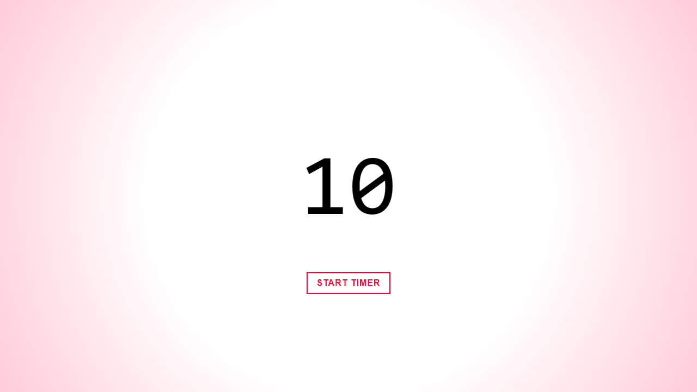

# Timer

<div align="center">
  <br />
  <a href="https://dstrekelj.github.io/algebra-example-timer" target="_blank">
    
    <br />
    <br />
    <b>See it in action &mdash; https://dstrekelj.github.io/algebra-example-timer</b>
  </a>
  <br />
  <br />
</div>

---

## Features

### Current

- [x] Configure element to serve as timer with `timer` ID
- [x] Configure starting time with `data-start-time` attribute
- [x] Configure time when blinking begins with `data-blink-time` attribute
- [x] Configure element to serve as timer start action with `data-action-start` attribute

### Upcoming

- [ ] Support for creating multiple timer instances
- [ ] SCSS styling

## Instructions

Include the stylesheet in the head of your document:

```html
<link rel="stylesheet" href="style.css" />
```

Include the script at the end of the body of your document:

```html
<script src="app.js"></script>
```

Use the `timer` ID to set the timer. Use the `data-start-time` and `data-blink-time` data attributes on the timer element to set the time from which countdown starts, and time at which the time begins to blink. Use the `data-action-start` attribute on the element that, when clicked, starts the timer.

```html
<div id="timer" class="timer" data-start-time="10" data-blink-time="5"></div>
<button data-action-start>Start timer</button>
```
